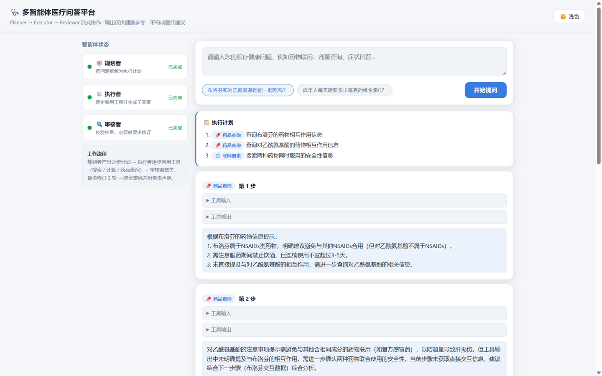
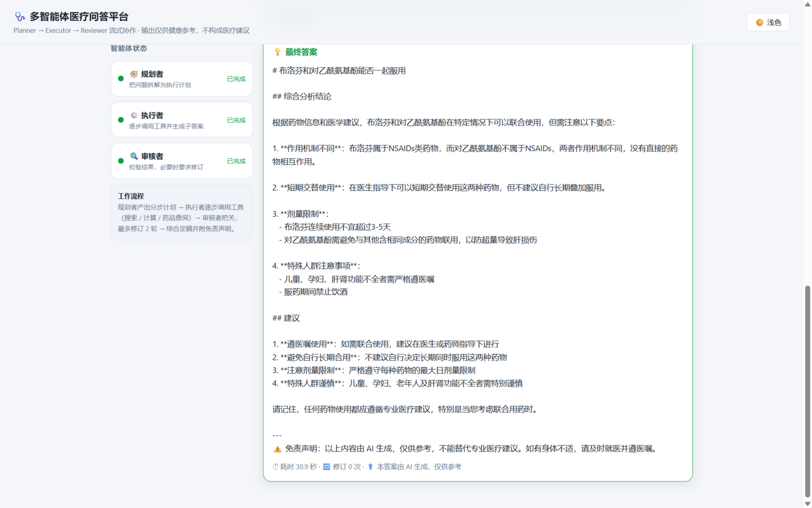

# LangChain 多智能体医疗问答平台

基于 **LangGraph** 的 Planner–Executor–Reviewer 三角色多智能体系统：把用户的医疗健康问题拆解为分步计划，逐步调用工具（联网搜索 / 安全计算器 / 药品查询），经审核者把关（可多轮修订）后综合定稿，全程通过 **SSE 流式推送**到浏览器可视化界面。

> ⚠️ 本项目所有输出仅供健康知识参考，不构成医疗建议；最终答案自动附带医疗免责声明。

## 架构

```
                          ┌──────────────────────────────────────────────┐
                          │              浏览器 static/index.html         │
                          │   fetch + getReader 手工解析 SSE，无构建依赖   │
                          └───────────────▲──────────────────────────────┘
                                          │ POST /api/chat (text/event-stream)
                          ┌───────────────┴──────────────────────────────┐
                          │         FastAPI  app/api/main.py             │
                          │  langgraph stream_mode=["updates","custom"]  │
                          │  → 翻译为 agent/plan/step/review/final 事件    │
                          └───────────────▲──────────────────────────────┘
                                          │
        ┌─────────────────────────────────┴───────────────────────────────┐
        │                     LangGraph 工作流（MemorySaver）              │
        │                                                                 │
        │   START ──▶ ┌─────────┐    ┌──────────┐    ┌──────────┐          │
        │             │ Planner │ ─▶ │ Executor │ ─▶ │ Reviewer │          │
        │             │ 规划分步 │    │ 调用工具  │    │ 审核把关 │          │
        │             └─────────┘    └──────────┘    └────┬─────┘          │
        │                          ▲          revise（≤2 轮）│             │
        │                          └───────────────────────┘              │
        │                                      │ approved / 超限           │
        │                                      ▼                         │
        │                                 ┌──────────┐                   │
        │                                 │ Finalize │ ──▶ END           │
        │                                 │ 综合定稿  │                   │
        │                                 └──────────┘                   │
        └────────────────────────────────────────────────────────────────┘
```

## 运行效果

提问「布洛芬和对乙酰氨基酚能一起吃吗？」的实际运行截图（浅色主题）：





## 工作流说明

| 角色 | 职责 | 容错策略 |
|------|------|----------|
| 规划者 Planner | 把问题拆解为 1–5 个结构化步骤（工具 + 输入 + 描述） | JSON 解析失败自动重试一次，仍失败回退单步「直接回答」计划 |
| 执行者 Executor | 逐步调用工具获取观测，LLM 综合产出子答案；通过 `_emit` 自定义事件实时上报进度 | 未注册工具返回空观测；工具异常转为文本反馈给 LLM |
| 审核者 Reviewer | 检查各步骤结果，给出 `approved` / `revise` 结论 | 解析失败默认通过，避免 revise 死循环 |
| 定稿 Finalize | 综合全部子答案生成最终回复 | 自动追加医疗免责声明 |

`revise` 时带反馈回到执行者重跑，最多 `MAX_REVISIONS`（默认 2）轮，超限强制定稿。

**内置工具**

- `web_search`：Tavily REST API；未配置密钥或网络失败时回退内置演示医疗数据
- `calculator`：基于 AST 白名单的四则运算（严格禁用 `eval`）
- `drug_lookup`：内置常见药品演示数据（适应症 / 用法用量 / 禁忌 / 注意事项）

## 快速开始

```bash
# 1. 创建虚拟环境（Python ≥ 3.12）并安装依赖
python -m venv .venv
.venv/Scripts/pip install -r requirements.txt   # Windows
# .venv/bin/pip install -r requirements.txt     # Linux/macOS

# 2. 配置密钥：复制示例文件并填入 SiliconFlow API Key
copy .env.example .env    # Windows
# cp .env.example .env    # Linux/macOS

# 3. 启动服务
.venv/Scripts/uvicorn app.api.main:app --port 8000

# 4. 打开浏览器访问 http://127.0.0.1:8000
```

## 配置（.env）

| 变量 | 必填 | 说明 |
|------|------|------|
| `SILICONFLOW_API_KEY` | ✅ | SiliconFlow 控制台获取（OpenAI 兼容端点） |
| `BASE_URL` | ❌ | 默认 `https://api.siliconflow.cn/v1` |
| `MODEL` | ❌ | 默认 `deepseek-ai/DeepSeek-V3`（SiliconFlow 需带命名空间） |
| `TAVILY_API_KEY` | ❌ | 留空则 `web_search` 回退内置演示数据 |
| `MAX_REVISIONS` | ❌ | 审核修订上限，默认 2 |

`.env` 已被 `.gitignore` 排除，绝不提交。

## API

### `POST /api/chat`

请求体：

```json
{ "question": "布洛芬和对乙酰氨基酚能一起吃吗？", "thread_id": "可选会话ID" }
```

响应 `text/event-stream`（响应头含 `Cache-Control: no-cache`、`X-Accel-Buffering: no`），事件协议：

| 事件 | 数据 | 说明 |
|------|------|------|
| `agent` | `{"role","phase","round"?}` | 角色开始/结束（`planner/executor/reviewer/finalizer` × `start/done`） |
| `plan` | `{"steps":[{"step","tool","description"}]}` | 执行计划 |
| `step` | `{"round","step","tool","tool_input","tool_output","sub_answer"}` | 步骤进度；`sub_answer` 为 `null` 表示工具已执行、子答案生成中；`tool_output` 截断至 500 字符 |
| `review` | `{"verdict","feedback"}` | 审核结论；`revise` 后将重发 executor/step 事件 |
| `final` | `{"answer","elapsed_ms","revisions"}` | 最终答案（含免责声明）、耗时与修订次数 |
| `error` | `{"message"}` | 仅出错时 |

### `GET /`

静态托管 `static/index.html` 前端单页。

## 测试

```bash
.venv/Scripts/python -m pytest tests/ -v
```

全部用例 mock LLM（不打真实 API），覆盖：规划/执行/审核/定稿单元、工作流拓扑与修订回环、SSE 事件序列、422 校验、错误降级等。

## 技术栈

langchain 1.4.0 · langgraph 1.2.11 · fastapi 0.141.1 · pydantic 2.13.5 · httpx 0.28.1 · pytest 9.1.1

## License

[MIT](LICENSE) © 2026 Li Yong
